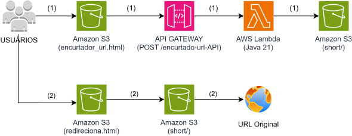

[JAVA__BADGE]:https://img.shields.io/badge/java-%23ED8B00.svg?style=for-the-badge&logo=openjdk&logoColor=white
[Amazon S3__BADGE]:https://img.shields.io/badge/Amazon%20S3-FF9900?style=for-the-badge&logo=amazons3&logoColor=white
[AWS__BADGE]:https://img.shields.io/badge/AWS-%23FF9900.svg?style=for-the-badge&logo=amazon-aws&logoColor=white

# Encurtador de URL 🔗

![Java][JAVA__BADGE]
![AWS][AWS__BADGE]
![Amazon S3][Amazon S3__BADGE]

Este sistema permite encurtar URLs longas, gerando uma versão reduzida.  
Ao acessar o link encurtado, o usuário vê uma página intermediária com contagem regressiva antes de ser redirecionado para a URL original.

## 💻 Tecnologias

- **Java (AWS Lambda)** 
- **AWS S3 (armazenamento de redirecionamentos)**
- **JavaScript (frontend)**
- **HTML/CSS**

## 🏗 Arquitetura



# 🔀 Fluxos da Aplicação

A aplicação possui dois fluxos principais:

- **(1) Criação da URL encurtada**
- **(2) Redirecionamento da URL curta**

---

## 🔵 (1) Criação da URL Encurtada

Este fluxo é responsável por gerar e armazenar uma nova URL encurtada.

### Etapas:

1. O usuário acessa `encurtador_url.html` hospedado no **Amazon S3 (Static Website)**.
2. O frontend envia uma requisição **POST** para o **API Gateway**.
3. O API Gateway encaminha a requisição para a **AWS Lambda (Java 21)**.
4. A Lambda:
   - Gera o identificador curto
   - Cria um objeto dentro do bucket S3 no caminho `short/`
5. A aplicação retorna ao usuário a URL encurtada no formato:

```text
http://seu-bucket.s3-website-us-east-1.amazonaws.com/redireciona.html?url-curta=abc123
```

Essa URL será utilizada posteriormente para realizar o redirecionamento.

---

## 🟢 (2) Redirecionamento da URL Curta

Este fluxo é responsável por redirecionar o usuário para a URL original utilizando o recurso nativo de redirecionamento do Amazon S3.

### Etapas:

1. O usuário acessa a URL encurtada gerada anteriormente:

```
http://seu-bucket.s3-website-us-east-1.amazonaws.com/redireciona.html?url-curta=abc123
```

2. O navegador carrega o arquivo `redireciona.html` hospedado no **Amazon S3 (Static Website)**.

3. O `redireciona.html` redireciona o navegador para:

```
http://seu-bucket.s3-website-us-east-1.amazonaws.com/short/abc123
```

4. O Amazon S3 encontra o objeto correspondente dentro do bucket no caminho `short/abc123`.

5. Esse objeto foi criado com a propriedade `WebsiteRedirectLocation`

6. O próprio Amazon S3 retorna  redirecionando o navegador para a URL original.


---

# 🟠 1️⃣ Criar Infraestrutura Base (Amazon S3)

## 1.1 Criar Bucket

1. Acesse o console da AWS  
2. Vá em **Amazon S3**  
3. Clique em **Create bucket**  
4. Configure:
   - Nome do bucket (ex: `meu-encurtador-bucket`)
   - Região (ex: `us-east-1`)
   - Em **Block Public Access settings**, desmarque:
     - `Block all public access`
   - Confirme o aviso exibido pela AWS

---

## 1.2 Criar Estrutura de Pastas

Após criar o bucket:

- Crie a pasta:
  - `short/` → onde a Lambda salvará os links encurtados

- Faça upload dos arquivos na raiz do projeto:
  - `encurtador_url.html`
  - `redirecionamento_URL.html`

(Arquivos localizados na pasta `paginas` do projeto)

---

## 1.3 Ativar Static Website Hosting

1. Vá em **Properties**
2. Ative **Static Website Hosting**
3. Configure:
   ```
   encurtador_url.html
   ```

4. Anote:
   - Nome do bucket
   - Região
   - URL pública do Website

Essas informações serão usadas nos próximos passos.

---

## 1.4 Configurar Lifecycle Rules

Para evitar que os links encurtados fiquem armazenados indefinidamente no S3, utilizamos **Lifecycle Rules** do Amazon S3 para excluir automaticamente os arquivos após um determinado período.

1. Acesse o **Bucket**
2. Vá na aba **Management**
3. Clique em **Lifecycle rules**
4. Clique em **Create lifecycle rule**
    - **Lifecycle rule name**: (ex: `Excluir-Short-Apos-1-Dia`)
    - Em **Choose a rule scope**, selecione:  
      `Limit the scope of this rule using one or more filters`
    - **Prefix**: `short/`  
      (Isso garante que **apenas os arquivos dentro da pasta `short/` serão afetados**.)
    - Em **Lifecycle rule actions**, selecione:  
      `Expire current versions of objects`
    - Em **Expire current versions of objects → Days after object creation**, defina:  
      `1`

      Após 24 horas o objeto se torna elegível para expiração.  
      Como o bucket não possui versionamento habilitado, o arquivo será excluído permanentemente.

5. Clique em **Create rule**

---


# 🚀 2️⃣ Criar Função AWS Lambda

## 2.1 Criar a Função

1. Vá em **AWS Lambda**
2. Clique em **Create function**
3. Escolha:
   - Runtime: **Java 21**
4. Clique em **Create**

---

## 2.2 Configurar o Handler

Após criar a função:

1. Vá em **Code**
2. Clique em **Runtime settings**
3. Configure o Handler no formato:

```
pacote.Classe::metodo
```

Para este projeto:

```
com.encurtador.Handler::handleRequest
```

--- 

# 🔐 3️⃣ Configurar Permissões (IAM)

A Lambda precisa de permissão para gravar no S3.

1. Vá em **Configuration**
2. Clique em **Permissions**
3. Clique no **Role name**
4. Clique em **Add permissions**
5. Clique em **Create inline policy**
6. Selecione **JSON**
7. Adicione:

```json
{
  "Version": "2012-10-17",
  "Statement": [
    {
      "Sid": "AllowPutObjectShort",
      "Effect": "Allow",
      "Action": "s3:PutObject",
      "Resource": "arn:aws:s3:::SEU-NOME-DE-BUCKET/short/*"
    }
  ]
}
```

Substitua `SEU-NOME-DE-BUCKET` pelo nome do seu bucket.

Essa policy segue o princípio de **Least Privilege**, permitindo escrita apenas na pasta `short/`.

Clique em **Next** → **Save changes**

---

# 🌐 4️⃣ Criar API no API Gateway

## 4.1 Criar Trigger

1. Vá na página da Lambda
2. Clique em **Add Trigger**
3. Selecione **API Gateway**
4. Escolha:
   - API Type: **HTTP API**
   - Security: **Open**
5. Clique em **Add**

---

## 4.2 Configurar Método POST

1. Acesse a API criada
2. Vá em **Routes**
3. Selecione a rota (ex: `/url`)
4. Clique em **Edit**
5. Troque de **ANY** para **POST**
6. Clique em **Save**

---

## 4.3 Configurar CORS

Para permitir que o frontend hospedado no S3 envie requisições JSON:

1. Acesse a API criada
2. Vá em **CORS**
3. Clique em **Configure**

Aplique as seguinte configurações:

**Access-Control-Allow-Origin**
```
https://seu-bucket.s3-website-us-east-1.amazonaws.com
```

**Access-Control-Allow-Headers**
```
Content-Type
```

**Access-Control-Allow-Methods**
```
POST, OPTIONS
```

O método `OPTIONS` é necessário para requisições de preflight feitas pelo navegador.

Salvar alterações.

---

# 🔒 5️⃣ Configurar Bucket Policy do S3(Leitura Pública + Escrita Restrita à Lambda)
Como o projeto utiliza **S3 Static Website Hosting** e acessa:

- 📄 Os arquivos `.html` e `.js` diretamente pela URL do bucket
- 🔗 Os arquivos de redirecionamento dentro da pasta `short/`

É necessário configurar o bucket para:

- ✅ Permitir leitura pública dos arquivos `.html` e `.js` na raiz do bucket  
- ✅ Permitir leitura pública dos arquivos dentro de `short/` (onde ficam os links encurtados)  
- 🔒 Permitir escrita (`PutObject`) apenas para a Lambda específica na pasta `short/`  
- 🚫 Bloquear qualquer escrita pública  


---


## 5.1 Aplicar a Bucket Policy

1. Vá em **Amazon S3**
2. Clique no seu bucket
3. Vá em **Permissions**
4. Clique em **Bucket Policy**
5. Adicione a seguinte policy:

```json
{
  "Version": "2012-10-17",
  "Statement": [
    {
      "Sid": "AllowPublicReadHtmlAndShort",
      "Effect": "Allow",
      "Principal": "*",
      "Action": "s3:GetObject",
      "Resource": [
        "arn:aws:s3:::SEU-NOME-DE-BUCKET/*.html",
        "arn:aws:s3:::SEU-NOME-DE-BUCKET/*.js",
        "arn:aws:s3:::SEU-NOME-DE-BUCKET/short/*"
      ]
    },
    {
      "Sid": "AllowOnlySpecificLambdaWrite",
      "Effect": "Allow",
      "Principal": {
        "AWS": "ARN-COMPLETO-DA-SUA-LAMBDA-ROLE"
      },
      "Action": "s3:PutObject",
      "Resource": "arn:aws:s3:::SEU-NOME-DE-BUCKET/short/*"
    }
  ]
}
```

---

## 5.2 Substituições obrigatórias

Substitua:

- `SEU-NOME-DE-BUCKET` → pelo nome do seu Bucket
- `ARN-COMPLETO-DA-SUA-LAMBDA-ROLE` → pelo ARN real copiado no IAM da Lambda

Exemplo real:

```
arn:aws:iam::123456789012:role/encurtador-url-role
```

---

## 🔐 O que essa configuração faz

### ✔ Permite:
- Leitura pública dos arquivos `.html` e `.js` na raiz
- Leitura pública dos links encurtados dentro de `short/`
- Escrita somente pela Lambda específica

### ❌ Bloqueia:
- Escrita pública
- Escrita por outras Lambdas
- Escrita por outros usuários IAM
- Escrita por outras contas AWS

---

# ⚙️ 6️⃣ Configurar Arquivos do Projeto

## 📝 6.1 Configurar `Handler.java`

Arquivo:

```
src/main/java/com/encurtador/Handler.java
```

Configure as constantes:

```java
private static final String BUCKET_NAME = "nome-do-seu-bucket";

private static final Region REGION = Region.US_EAST_1;

private static final String S3_WEBSITE_ORIGIN =
"http://nome-do-seu-bucket.s3-website-us-east-1.amazonaws.com";

private static final String SHORT_PATH = "short";

private static final String REDIRECT_PATH = "redireciona.html";

private static final String REDIRECT_BASE_URL =
S3_WEBSITE_ORIGIN + "/" + REDIRECT_PATH + "?url-curta=";
```

Depois disso:

1. Compile o projeto para gerar o arquivo `.jar`
3. Vá em **AWS Lambda**
2. Clique na função Lambda que você já criou.
3. Vá na aba **Code**.
4. Em **Code source**, clique em **Upload from → .zip or .jar file**.
5. Clique em **Upload** e selecione o arquivo `.jar` gerado pelo build do projeto (ex: `target/encurtador-url-1.0.jar`).
6. Clique em **Save**.
---

## 📝 6.2 Configurar `configAWS_exemplo.js`

Arquivo:

```
paginas/configAWS_exemplo.js
```

### Passo a passo para obter a URL da Lambda

1. Vá no **API Gateway**
2. Clique na **API** que você vinculou à sua Lambda
3. No menu lateral, clique em **Stages**
4. Clique no **stage** que você criou (geralmente `default` ou `prod`)
5. Copie o **Invoke URL** exibido no topo, algo como:

```
https://rhyr2si935.execute-api.us-east-1.amazonaws.com/default
```

6. Junte a **rota que você configurou como POST** para obter a URL final da API.  
   Exemplo:


```
https://rhyr2si935.execute-api.us-east-1.amazonaws.com/default/encurtado-url-API
```

Exemplo:

```javascript
// Configuração para o redireciona.html
const S3_WEBSITE_URL =
"https://SEU-BUCKET-S3-WEBSITE.amazonaws.com/";

// Configuração para o encurtador_url.html
const API_ENCURTADOR_URL =
"https://rhyr2si935.execute-api.us-east-1.amazonaws.com/default/encurtado-url-API";
```

Depois disso:

1. Renomeie o arquivo para `configAWS.js`.
2. Acesse seu **Bucket S3**.
3. Faça o **upload na raiz** do bucket, para que os arquivos HTML consigam acessá-lo corretamente.

---
## 🔎 Como Usar

1. **Acesse** a URL pública do `encurtador_url.html` dentro do **bucket S3**

    Exemplo: `https://<seu-bucket>.s3-website-us-east-1.amazonaws.com`

2. **Digite** a URL que deseja encurtar no campo indicado.
3. **Aperte** o botão para enviar o formulário
4. **Copie** ou clique no link encurtado que será gerado automaticamente.

## 🔧 Como Funciona

O encurtador de URL funciona da seguinte forma: ao enviar uma URL pelo formulário HTML, o sistema faz uma chamada para o API Gateway, que aciona a função AWS Lambda, onde está o código em Java.

Dentro dessa função, existe uma lógica para gerar uma URL curta única, garantindo que não existam duas URLs curtas iguais no S3. Além disso, as URLs curtas têm um prazo de validade de 24 horas, definido nativamente pela configuração do próprio S3.

Após todas as validações, a Lambda retorna uma URL curta que leva o usuário a uma página intermediária, onde ocorre uma contagem regressiva, antes do redirecionamento final para a URL original.

## 🤝 Colaboradores

| [Daniel Sodré](https://github.com/daniel-sd03) |
| :--------------------------------------------: |
